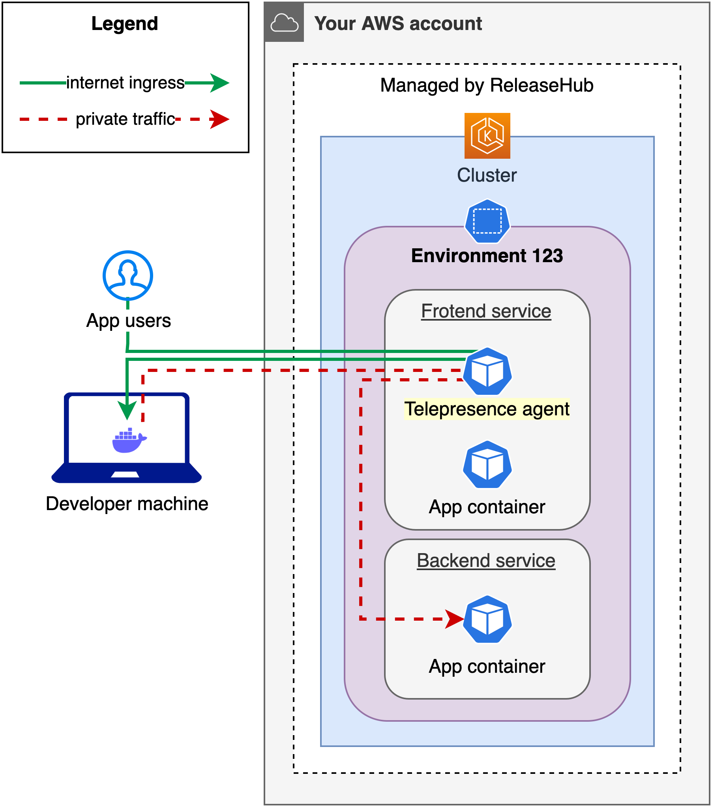
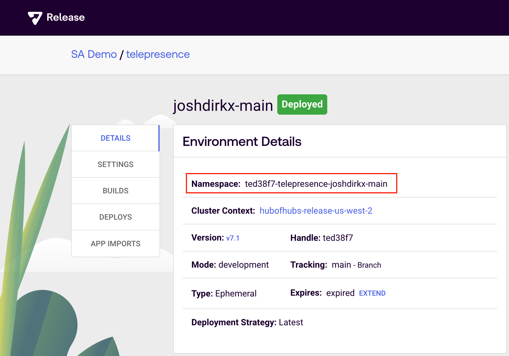
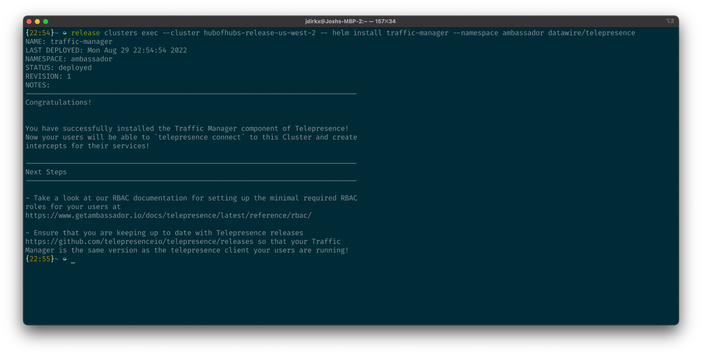
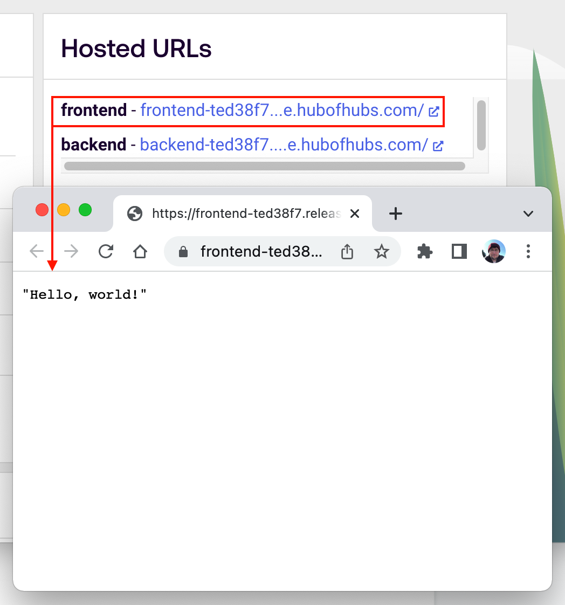
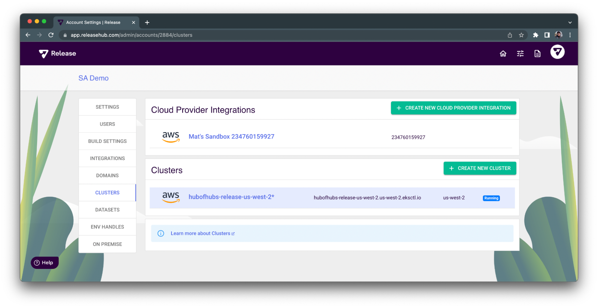
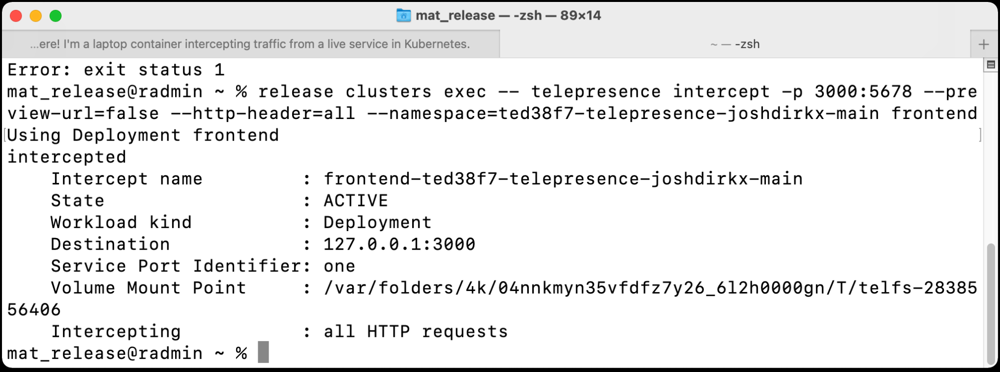
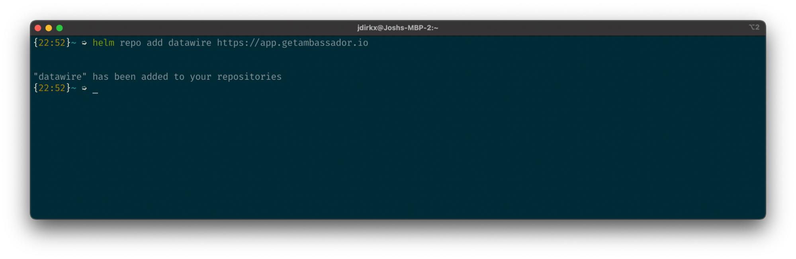
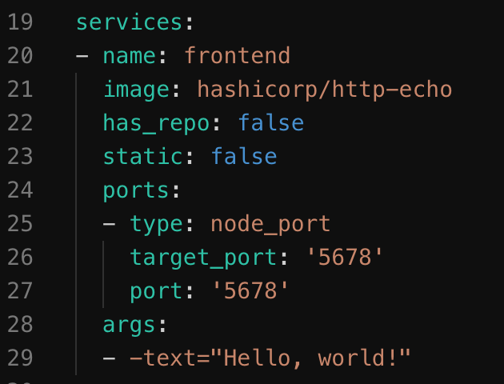

# Telepresence with Amazon EKS and ReleaseHub

This project demonstrates how to use [Telepresence.io](https://www.telepresence.io/docs/latest/quick-start/) to intercept traffic sent to a [ReleaseHub](https://releasehub.com)-managed Kubernetes service on Amazon EKS in your AWS account and reroute it to your local developer machine.

This readme contains a generic quickstart followed by a more detailed [Example Walkthrough with ReleaseHub](#example_walkthrough_with_releasehub).

## Overview

### ReleaseHub

[ReleaseHub](https://releasehub.com) _environments-as-a-service_ (EaaS) offloads the heavy lifting of cloud infrastructure and service configuration by translating files like `docker-compose.yaml` or `package.json` into _complete_, full-stack ephemeral cloud environments in your own cloud accounts. Users may also package virtually any existing code (e.g. infra-as-code, test automation, or database migrations) into a ReleaseHub template.

### Telepresence

[Telepresence](https://www.telepresence.io/) is an open-source project developed by [Ambassador Labs](https://www.getambassador.io/) that allows a developer to temporarily redirect traffic from a Kubernetes container service to their own local machine. Telepresence has a wide range of configuration options and use cases, and their documentation is the best way to learn about it's full capabilities.

### Ambassador

[Ambassador](https://www.getambassador.io/products/telepresence/) is a commercial extension from Ambassador Labs provides useful additional capabilities on top of Telepresence, like a team-centric UI to manage services & connections, the ability for a developer to generate preview URLs to their loca service to share with their team, and more.

The Telepresence CLI includes the ability to interact with Ambassador and may prompt you to create and use an account, but at the time of this writing, paid licenses are not required to use Telepresence.

### ReleaseHub & Telepresence

The diagram below shows a simplfied version of what ReleaseHub could provide just by supplying a Docker Compose file listing a two-tier container application environment:



## Prerequisites

* ReleaseHub user has the `owner` role within the account you intend to use
* ReleaseHub account is on a full-access plan (paid or temporary full-access trial
* Your account has an Amazon EKS cluster created using ReleaseHub
* On your local developer machine:
  
  * [kubectl CLI](https://kubernetes.io/docs/tasks/tools/)
  * [Helm CLI](https://helm.sh/docs/intro/install/)
  * Optional: [yq](https://github.com/mikefarah/yq/#install) (for parsing ReleaseHub CLI output)

### MacOS requirement

Recent MacOS versions are missing a dependency on osfxuse that requires a workaround described in [the Telepresence troubleshooting guide](https://www.telepresence.io/docs/latest/troubleshooting/).

## Quickstart

This quickstart is written with ReleaseHub users in mind, though most is still applicable to the broader community.

1. [**Install the Telepresence CLI & daemon** on your local machine.](https://www.telepresence.io/docs/latest/install).
  
1. **Install the Telepresence Traffic Manager** into your EKS cluster with:

    ```sh
    release clusters exec -- telepresence helm install
    ```

    This will install the Traffic Manager into it's own `ambassador` namespace, and this Traffic Manager will proxy traffic between the Telepresence daemon on your local machine and the Telepresence agent sidecar container added to your Kubernetes pods when you later use the Telepresence CLI to intercept a service or otherwise connect to a namespace.

    [Telepresence Traffic Manager](https://www.telepresence.io/docs/latest/reference/architecture) installed into your ReleaseHub EKS cluster.

1. **Create or select a service to intercept:** From within the [ReleaseHub Web Console](https://releasehub.com) or by using the ReleaseHub CLI ([example])(#browse_with_cli)), identify or create an environment on a ReleaseHub-managed EKS cluster with a container service that you want to intercept and write down the environment's `namespace` and service's `name`.

    If none of your ReleaseHub Application Templates define a service that makes sense for traffic interception, you can fork one of the projects in GitHub at [https://github.com/awesome-release](https://github.com/awesome-release) and transform into a new Application & Environment. We recommend using an example that contains a frontend service with public ingress, such as [awesome-release/angular](https://github.com/awesome-release/angular).

1. **Remove the resource quota on your environment namespace:** ReleaseHub places a memory resource quota on each environment's Kubernetes namespace with a dynamically-generated value that matches the the aggregate memory requested by services in your Application Template. When a memory quota is present, Kubernetes will reject containers that do not explicitly set container-level memory limits. However, when Telepresence intercepts traffic, it adds a traffix proxy container to your namespace that does not contain a memory limit.

    Remove the default memory quota on your ReleaseHub environment's namespace:

    ```sh
    release clusters exec -- kubectl delete resourcequota quota --namespace YOUR_NAMESPACE
    ```

    ReleaseHub re-adds this quota each time you deploy an update to an environment, so remember to remove the quota.

1. **Start a local service to intercept traffic:** On your local machine, start and leave running a service that you want to use as the target for the traffic intercepted from your remote environment service.

    Or, if you just want to quickly test Telepresence with a local service, you can simply run an HTTP or TCP echo server with one of the commands below:

    **HTTP Echo Server:**

    ```sh
    # HTTP echo server:
    docker run -p 8080:5678 hashicorp/http-echo -text="Hello, I am your local service intercepting traffic from your remote environment."
    ```

    **TCP Echo Server:**

    ```sh
    # TCP echo server:
    docker run -d --name echo -p 8080:9999 abrarov/tcp-echo --port 9999 --inactivity-timeout 300
    ```

1. **Intercept remote EKS service traffic:** With your remote service identified and your local service running, you are now ready to intercept traffic with Telepresence.

    ```sh
    export TELEPRESENCE_LOCAL_PORT=8080
    export TELEPRESENCE_SERVICE_NAME=frontend
    export TELEPRESENCE_NAMESPACE=multifeature-demo-main
    export RELEASE_CLUSTER=hubofhubs-release-us-west-2

    # Remove namespace quota created by ReleaseHub, if needed:
    release clusters exec -- kubectl delete resourcequota quota --namespace YOUR_NAMESPACE

    release clusters exec --cluster $RELEASE_CLUSTER -- \
        telepresence intercept \
        --preview-url=false \
        --http-header=all \
        -p $TELEPRESENCE_LOCAL_PORT \
        -n $TELEPRESENCE_NAMESPACE \
        $TELEPRESENCE_SERVICE_NAME
    ```

## Telepresence Walkthrough with ReleaseHub Example <a name="example_walkthrough_with_releasehub">

In this section, we'll walk through an example specific to a ReleaseHub Environment on Amazon EKS.

### Installing Telepresence Locally

Install Telepresence on your local machine per the installation instructions located [here](https://www.telepresence.io/docs/latest/install/). In our experience, MacOS users will also need to install `macfuse` and `sshfs-mac` as described in the [Telepresence docs, here](https://www.telepresence.io/docs/latest/troubleshooting/).

### Installing Telepresence In EKS Cluster

Installing the Telepresence Traffic Manager into your Amazon EKS cluster requires two pieces of information: your ReleaseHub account name (or ID), and the name of your cluster. You can find the cluster name of a specific Application from the value of the **context** key in your ReleaseHub Application Template or from your ReleaseHub _Account Settings_.

For example, we will use our account's only cluster, `hubofhubs-release-us-west-2`, as shown below:



To prepare the remote cluster, the Telepresence traffic-manager will need to be installed into a dedicated namespace on the cluster using [Helm](https://helm.sh/). Installation instructions for Helm are located [here](https://helm.sh/docs/intro/install/).

With Helm installed, add the appropriate repository for the Telepresence traffic-manager.

```sh
helm repo add datawire https://app.getambassador.io
```



Installing the Helm [chart](https://helm.sh/docs/topics/charts/) requires access to your remote cluster. For clusters being utilized by ReleaseHub, this is easily accomplished with the [ReleaseHub CLI](https://docs.releasehub.com/cli/installation). Follow the [installation](https://docs.releasehub.com/cli/installation), [configuration](https://docs.releasehub.com/cli/configuration), and [authentication](https://docs.releasehub.com/cli/getting-started) instructions to set up the ReleaseHub CLI for your account and target cluster.

Using the ReleaseHub CLI’s _cluster exec_ command, install the Telepresence traffic manager  into a new _ambassador_ namespace [Note 1](#note_on_ambassador_namespace)**:

```sh
release clusters exec --cluster :CLUSTER_NAME -- helm install traffic-manager --create-namespace --namespace ambassador datawire/telepresence
```



**Note 1** <a name="note_on_ambassador_namespace"> - [Ambassador](https://app.getambassador.io/cloud/preview/?fromLogin=true) is the name of a commercial extension offered by Ambassador Labs, the developers behind Telepresence. Certain default settings of Telepresence expect the traffic manager to be in the `ambassador` namespace. If you want to use a different name, refer to Telepresence documentation for needed changes.

### Intercepting a Running Service

With dependencies taken care of, we will now prepare to intercept traffic.

To follow along, you will need to have an existing Application Template defining a service you want to intercept and an already-running or newly deployed environment. Containerized web frontend apps are an easy way to test things out, and our example will use [hashicorp/http-echo](https://github.com/hashicorp/http-echo) to simply return “Hello, world!” to any inbound requests received.

Once you have a candidate service identified, you’ll need the service name, service port, and namespace of the container you want to intercept. You can find this information as shown below:

Namespace available on environment’s _Details_ page:



Service name is in your Environment Configuration on the _Settings_ tab of your environment:



* The `port` refers to the the service port receiving external traffic and is the port you want to use.

Current response from our environment’s example frontend:



For our demo, we’ll be using the `frontend` service in the `ted38f7-telepresence-joshdirkx-main`.

### Remove your ReleaseHub namespace quota

ReleaseHub places a default memory quota on namespaces as part of the automation we do for customers, but as of this writing, Telepresence doesn’t yet have a way to specify a container memory limit on the traffic agent we will later inject into the namespace (_[see GitHub for latest status](https://github.com/telepresenceio/telepresence/issues/2727#issuecomment-1236234460)_). So, if you’re using ReleaseHub or you otherwise have a quota on your namespace, you will need to first remove it with a command like below:

`release clusters exec -- kubectl delete resourcequota quota --namespace YOUR_NAMESPACE`

To see the list of quota(s) in a namespace, use this command:

`release clusters exec -- kubectl get resourcequotas --namespace YOUR_NAMESPACE`

### Start a local service

You next need to run a service on your local machine to act as the target for intercepted traffic. This can be any process listening on any port you like, though in practice this is normally a local build of your remote service that contains changes you want to test before pushing a commit.

In our example, we’ll again use hashicorp/http-echo to run a local web server container listening on localhost:3000, but this time we’ll change the message to later make it obvious that the intercept is working:

```sh
docker run -p 3000:5678 hashicorp/http-echo -text="Hi, there! I'm a laptop container intercepting traffic from a live service in Kubernetes."
```

### Intercept Traffic

Once your local service is running,   you’re now ready use Telepresence to intercept your remote traffic and reroute it to the port of your local machine with the command below:

```sh
release clusters exec -- telepresence intercept -p LOCAL_PORT:REMOTE_PORT --preview-url=false --http-header=all --namespace=:NAMESPACE :SERVICE_NAME
```

If you a message like below, your intercept was created successfully:



### Cleanup

When you’re finished, be sure to run `telepresence leave` to end the current intercept. This will still leave the traffic agent proxy within your service’s remote pod for future connections. To also remove the remote container agent, you can optionally run `telepresence uninstall`.

## Appendix

### Considerations CI/CD-based Deployments

If your Kubernetes services are built from manifests generated as part of a CI/CD pipeline, subsequent deployments to a namespace may end up overwriting the Kubernetes deployment, stateful, and/or replica sets that Telepresence modified to inject a service’s traffic agent. You can add an annotation, [telepresence.getambassador.io/inject-traffic-agent: enabled](https://www.telepresence.io/docs/latest/reference/cluster-config/), to your deployment spec to modify Telepresence’s behavior as a workaround.

### Using ReleaseHub CLI to browse Applications and Environments

As an alternative to the ReleaseHub Web Console, you can use the ReleaseHub CLI to explore available Applications, environments, and more. Examples are below:

```sh
# Find an application
release apps list

# Find running environment(s) for a given app ID:
release environments list --app <APP_ID>

# Return the "services:" section of an existing ReleaseHub environment
release config-get --app <APP_ID> --environment <ENV_ID> | yq '.services'
```

## Troubleshooting

### No kind "ExecCredential" is registered for version "client.authentication.k8s.io/v1alpha1"

Kubernetes deprecated the alpha version of an API used for cluster user authentication, `client.authentication.k8s.io/v1alpha1`, in `kubeconfig` with K8s version 1.24. If you have an old version of `kubectl` installed, you may receive an error like this when attempting to run commands line `telepresence helm install` or `release clusters exec kubectl get svc`:

```text
Unable to connect to the server: getting credentials: decoding stdout: no kind "ExecCredential" is registered for version "client.authentication.k8s.io/v1alpha1" in scheme "pkg/client/auth/exec/exec.go:62"
```

Upgrading to the latest version of kubectl should fix this.

If you are using AWS IAM helpers in your `~/.kube/config` to access your Amazon EKS cluster using IAM access keys or an IAM role from your local AWS CLI profile, the AWS CLI is used under-the-hood to retrieve temporary credentials from EKS. Old versions of the CLI will also have the same problem ([PR 6476](https://github.com/aws/aws-cli/pull/6476)) as kubectl, above, and should be upgraded.
